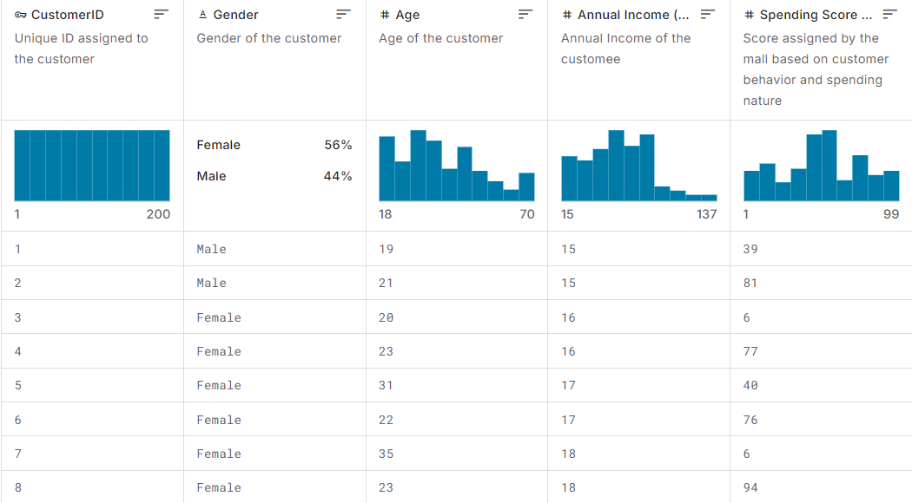
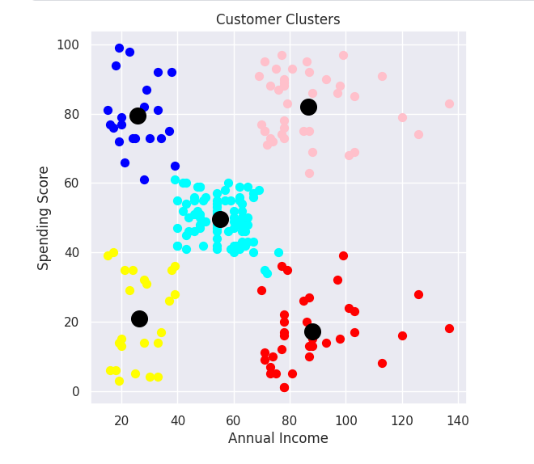

# 🛍️ Customer Segmentation using K-Means Clustering 🎯
## 📄 Overview
This project focuses on customer segmentation using the popular K-Means Clustering algorithm. 🧠💡 By analyzing a mall customers dataset from Kaggle, we cluster customers based on their annual income and spending score to understand different customer behaviors and groups. 📊🔍

Customer segmentation is a critical process for businesses to tailor marketing strategies, improve customer service, and increase profitability. This project visualizes customer groups to help identify high-value customers, bargain seekers, or others based on income and spending habits. 🛒💼

## 🔑 Key Features
- 🎯 K-Means Clustering Algorithm: Efficiently clusters customers into distinct groups using unsupervised machine learning.
- 💵 Annual Income & Spending Score: Groups customers based on their income levels and how much they spend at the mall.
- 📊 Visual Representation: 2D and 3D plots generated with Matplotlib and Seaborn for interactive and clear visualization of customer clusters.
- 📈 Actionable Insights: Helps businesses understand and target different customer segments more effectively.
## ⚙️ Tech Stack
- Python 🐍
- K-Means Clustering 🎯
- Pandas 🐼
- NumPy 🔢
- Matplotlib 📊
- Seaborn 🖼️

## 🔍 Dataset Information
The mall customers dataset used in this project is sourced from Kaggle and contains data on customer demographics, annual income, and spending habits. 📊
Key columns include:
- CustomerID: Unique ID for each customer.
- Age: Age of the customer.
- Annual Income: Income of the customer in thousands of dollars. 💵
- Spending Score: A score assigned based on how much the customer spends. 💳




## 🚀 How to Run the Project
1. Clone the Repository:
```
git clone https://github.com/Vedant3000/Customer-Segmentation-using-KMeans-Clustering
.git
```
2. Install Dependencies:
```
pip install -r requirements.txt
```
3. Run the Model:
```
python customer_segmentation.ipynb
```
## View Clusters: 
The script will generate visual plots to show how customers are segmented into distinct groups based on income and spending score. 📊👥
## 📊 Visualizations
- 2D Plot: Displays clusters of customers with annual income on the X-axis and spending score on the Y-axis. See how customers group into different clusters based on their behaviors. 🏷️🎯
- 3D Plot: For a more detailed view, this plot includes an additional dimension of customer behavior. 📈🔍



## 🎯 Insights from Customer Clusters
- High Income, High Spending: These are the premium customers, spending a lot and bringing in high value. 🎩💼
- Low Income, High Spending: Customers who may be loyal but spend a larger proportion of their income. 🛍️
- High Income, Low Spending: Customers with potential for upselling and marketing efforts. 💰
- Low Income, Low Spending: Price-sensitive customers, often targeted with discounts. 💸
## 🌟 Future Enhancements
- 📊 Add More Features: Integrate additional customer features like age, gender, or purchase frequency to enhance segmentation.
- 🌐 Web Application: Build an interactive web interface using Flask or Streamlit to allow users to input new data and get real-time segmentation results.
🧠 Advanced Algorithms: Experiment with other clustering techniques like DBSCAN or Agglomerative Clustering to compare performance.
